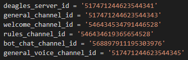

# Liberty Prime Discord Bot

[](https://travis-ci.org/python/mypy) [](https://gitter.im/python/typing?utm_source=badge&utm_medium=badge&utm_campaign=pr-badge&utm_content=badge) [](http://mypy-lang.org/)

### Description
A discord bot that is created to mimic [Liberty Prime](https://fallout.fandom.com/wiki/Liberty_Prime).

### Installation and Set-up

* Clone this code to your machine.
* Create a [new bot in discord](https://www.digitaltrends.com/gaming/how-to-make-a-discord-bot/)
* Install [python](https://www.python.org/downloads/)
* Install [pip](https://pypi.org/project/pip/) (should come as a python installation option)
* Go through the code and make sure you replace the server/channel IDs with your own IDs.
  
<p align="center">
  
</p>

* If you want the bot to use audio clips in voice chat, then you will need to install ffmpeg. [Here is a link to a Windows installation guide for ffmpeg...](http://blog.gregzaal.com/how-to-install-ffmpeg-on-windows/)

* Go to your command line and enter...

&nbsp;&nbsp;&nbsp;&nbsp;`$ pip install discord` or you might have to use `$ python -m pip install discord.py==0.16.12`
&nbsp;&nbsp;&nbsp;&nbsp;`$ pip install Pillow`
&nbsp;&nbsp;&nbsp;&nbsp;`$ pip install pynacl`
&nbsp;&nbsp;&nbsp;&nbsp;`$ pip install random`
&nbsp;&nbsp;&nbsp;&nbsp;`$ python main.py`

If done correctly then the bot should post into your server's general channel on wake-up.

### To-Do
* Continue updating the README.
* Reformat the project folders to be more consistent with modern readability standards.
* Remove __pycache_\_ folder from the repo.
* Enable audio clips to play in voice channels.
  *  Known bug - An known error with ffmpeg where the number of frames needed to play the audio is cut short. [Read More](https://github.com/amiaopensource/vrecord/issues/340)
    ```python
       av_interleaved_write_frame() broken pipe error writing trailer of        pipe:1: broken pipe
    ```
* Enable bot to read key words in on_message() such as 'communism' and 'liberty'
  and repond aptly.

## Dependencies

* [sigma.core](https://pypi.python.org/pypi/sigma.core/)
* [ffmpeg](https://pypi.org/project/pytranscoder-ffmpeg/)

## License
Liberty Prime Discord Bot is available under the [MIT License](http://opensource.org/licenses/mit-license.php).